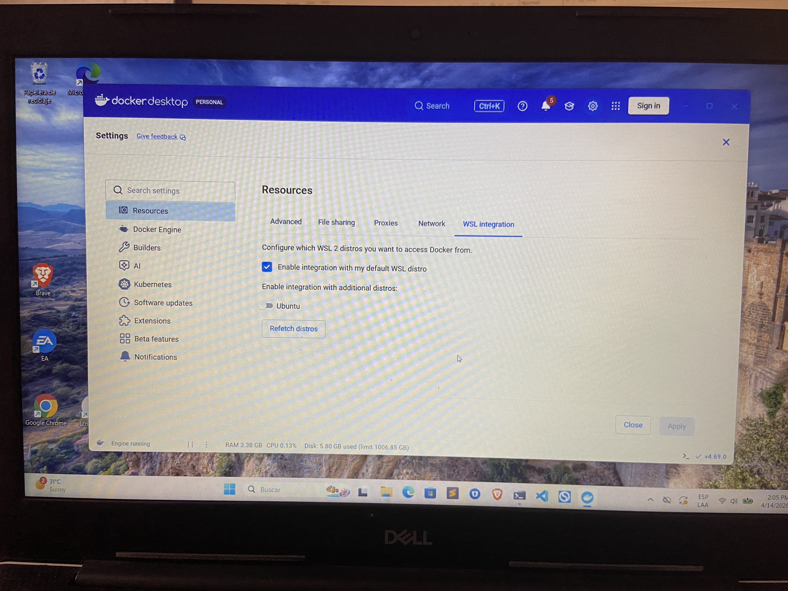
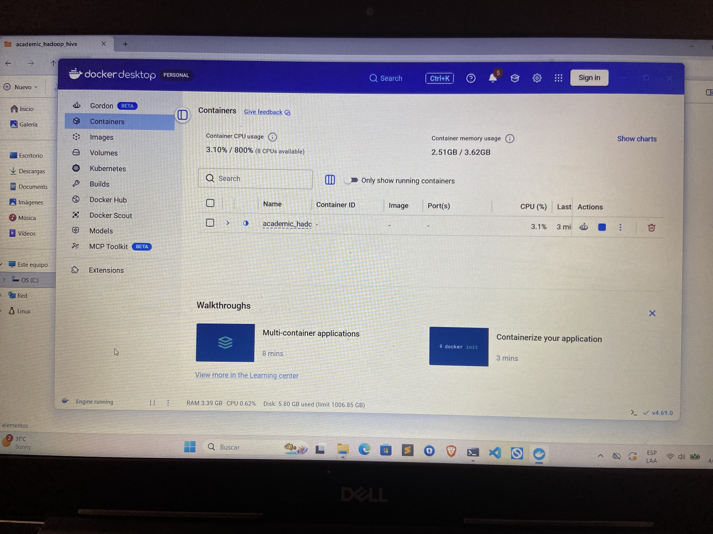
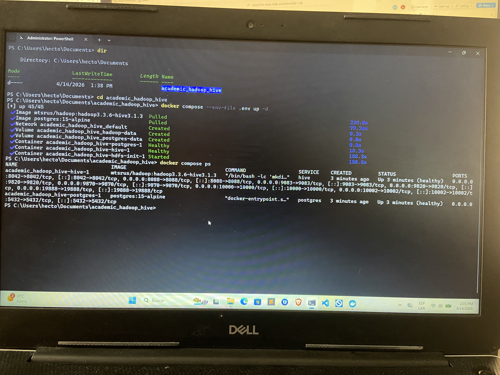
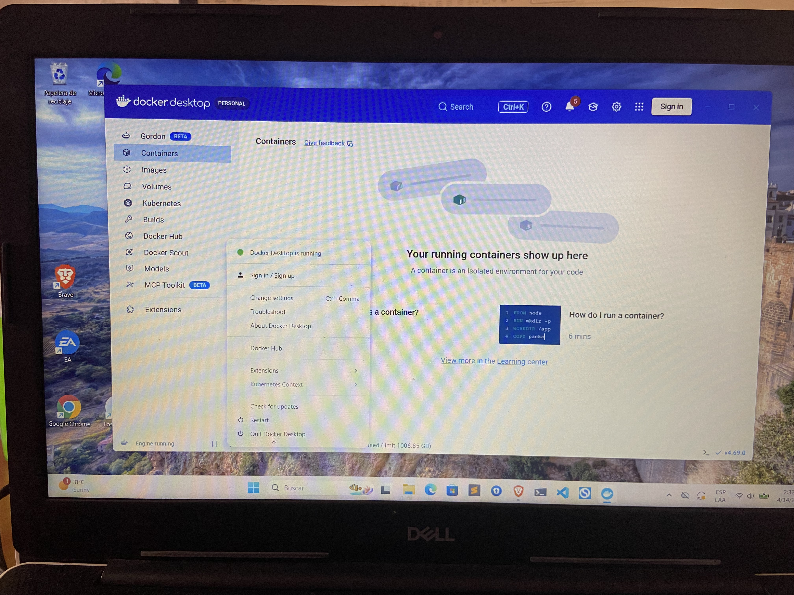

# Guia para Windows

**Importante:** esta guia esta escrita para **PowerShell**, no para `cmd.exe`.

Docker puede funcionar desde la terminal clasica de Windows, pero para este proyecto se recomienda usar PowerShell porque:

- maneja mejor rutas con espacios
- los comandos de `docker cp` son mas claros
- la sintaxis de los ejemplos de esta guia esta pensada para PowerShell

Version recomendada:

- **PowerShell 7** es la mejor opcion
- **Windows PowerShell 5.1** tambien deberia funcionar para esta guia

Esta guia explica como instalar Docker Desktop, levantar el stack y usar Hadoop/Hive desde PowerShell.

## 1. Instalar Docker Desktop

### Descargar Docker Desktop

Descargalo desde:

<https://www.docker.com/products/docker-desktop/>

### Durante la instalacion

Asegurate de que esten habilitadas estas opciones:

- usar **WSL2**
- usar **Linux containers**

Revisa esta pantalla de referencia para ubicar la opcion de integracion con WSL2 en Docker Desktop:



### Abrir Docker Desktop

Despues de instalar Docker Desktop, **tienes que abrirlo y dejarlo corriendo**. Si Docker Desktop no esta abierto, los comandos de Docker en PowerShell no van a funcionar.

Se ve mas o menos asi cuando esta abierto:



### Verificar instalacion

Abre **PowerShell** y ejecuta:

```powershell
docker --version
docker compose version
```

## 2. Preparar el proyecto

Primero clona el repositorio:

```powershell
git clone https://github.com/cfocoder/academic_hadoop_hive.git
```

Luego entra a la carpeta del proyecto:

```powershell
cd academic_hadoop_hive
```

Copia el archivo de variables:

```powershell
copy .env.example .env
```

Abre `.env` con Notepad:

```powershell
notepad .env
```

Cambia esta linea:

```env
POSTGRES_PASSWORD=CHANGE_ME
```

Por una contrasena real.

## 3. Levantar el stack

```powershell
docker compose --env-file .env up -d
```

Cuando termina correctamente, la salida se ve similar a esta:



## 4. Revisar si ya quedo listo

```powershell
docker compose ps
```

Estado esperado:

- `postgres` healthy
- `hive` healthy
- `hdfs-init` Exited (0)

Tambien puedes abrir en el navegador:

- `http://localhost:9870`
- `http://localhost:8088`
- `http://localhost:10002`

## 5. Detener el stack

```powershell
docker compose stop
```

Cuando termines de trabajar, este es el flujo recomendado:

1. salir de Beeline si lo tienes abierto
2. detener el stack con `docker compose stop`
3. cerrar Docker Desktop

En Docker Desktop, puedes cerrarlo desde el icono de la bandeja del sistema:



## 6. Volver a encenderlo

```powershell
docker compose start
```

## 7. Entrar a Hive desde terminal

### Abrir Beeline

```powershell
docker compose exec hive beeline -u jdbc:hive2://hive:10000/default -n anonymous
```

### Comandos basicos dentro de Hive

```sql
show databases;
use default;
show tables;
```

Ejemplo:

```sql
CREATE DATABASE IF NOT EXISTS maestria_db;
USE maestria_db;
SHOW TABLES;
```

Salir de Beeline:

```sql
!quit
```

## 8. Comandos basicos de HDFS

### Listar directorios

```powershell
docker compose exec hive hdfs dfs -ls /
docker compose exec hive hdfs dfs -ls /user
```

### Crear directorios

```powershell
docker compose exec hive hdfs dfs -mkdir -p /user/tu_usuario
docker compose exec hive hdfs dfs -mkdir -p /user/tu_usuario/input
docker compose exec hive hdfs dfs -mkdir -p /user/tu_usuario/parquet
```

### Borrar archivos

```powershell
docker compose exec hive hdfs dfs -rm /user/tu_usuario/input/archivo.txt
```

### Borrar directorios

```powershell
docker compose exec hive hdfs dfs -rm -r /user/tu_usuario/input
```

### Ver contenido de un archivo

```powershell
docker compose exec hive hdfs dfs -cat /user/tu_usuario/input/archivo.txt
```

## 9. Copiar archivos de Windows al contenedor

Para subir archivos a HDFS, primero hay que copiarlos al contenedor, normalmente a la carpeta `/tmp`, y despues moverlos desde ahi hacia HDFS.

La razon es que el contenedor funciona como un entorno separado, parecido a una maquina virtual ligera. Hadoop dentro del contenedor no puede leer directamente archivos que estan en tu computadora. Por eso el flujo correcto es:

1. tu maquina Windows -> `/tmp` dentro del contenedor
2. `/tmp` dentro del contenedor -> HDFS

Primero obten el ID del contenedor `hive`:

```powershell
docker compose ps -q hive
```

Ejemplo de resultado:

```powershell
3f8c2a1b7d9e
```

En los siguientes comandos, reemplaza el ID del contenedor por tu valor real.

### Copiar un archivo local a `/tmp` dentro del contenedor

```powershell
docker cp "C:\ruta\local\archivo.txt" "3f8c2a1b7d9e:/tmp/archivo.txt"
```

Ejemplo:

```powershell
docker cp "C:\Users\TuUsuario\Downloads\warandpeace.txt" "3f8c2a1b7d9e:/tmp/warandpeace.txt"
```

### Copiar una carpeta completa a `/tmp`

```powershell
docker compose exec hive mkdir -p /tmp/input
docker cp "C:\Users\TuUsuario\Downloads\mis_archivos\." "3f8c2a1b7d9e:/tmp/input/"
```

### Verificar que el archivo si llego

```powershell
docker compose exec hive ls -lh /tmp
docker compose exec hive ls -lh /tmp/input
```

Si prefieres hacerlo en un solo comando sin copiar manualmente el ID, tambien puedes usar esta version:

```powershell
docker cp "C:\ruta\local\archivo.txt" "$(docker compose ps -q hive):/tmp/archivo.txt"
```

Pero para empezar, suele ser mas claro obtener el ID primero y luego pegarlo de forma explicita.

## 10. Subir archivos desde `/tmp` del contenedor hacia HDFS

### Subir un archivo

```powershell
docker compose exec hive hdfs dfs -put /tmp/archivo.txt /user/tu_usuario/input/
```

### Subir varios archivos

```powershell
docker compose exec hive bash -lc 'hdfs dfs -put /tmp/input/* /user/tu_usuario/input/'
```

### Verificar en HDFS

```powershell
docker compose exec hive hdfs dfs -ls /user/tu_usuario/input
```

## 11. Crear tablas externas en Hive

### Tabla externa sobre archivos Parquet

```powershell
docker compose exec hive beeline -u jdbc:hive2://hive:10000/default -n anonymous
```

Dentro de Beeline:

```sql
CREATE DATABASE IF NOT EXISTS maestria_db;
USE maestria_db;

CREATE EXTERNAL TABLE IF NOT EXISTS ejemplo_parquet (
  id INT,
  nombre STRING
)
STORED AS PARQUET
LOCATION '/user/tu_usuario/parquet/ejemplo';
```

### Tabla externa sobre archivos CSV

```sql
CREATE DATABASE IF NOT EXISTS maestria_db;
USE maestria_db;

CREATE EXTERNAL TABLE IF NOT EXISTS ejemplo_csv (
  id STRING,
  nombre STRING
)
ROW FORMAT SERDE 'org.apache.hadoop.hive.serde2.OpenCSVSerde'
WITH SERDEPROPERTIES (
  "separatorChar" = ",",
  "quoteChar" = "\"",
  "escapeChar" = "\\"
)
STORED AS TEXTFILE
LOCATION '/user/tu_usuario/csv/ejemplo'
TBLPROPERTIES ("skip.header.line.count"="1");
```

### Probar la tabla

```sql
SELECT * FROM ejemplo_parquet LIMIT 10;
SELECT COUNT(*) FROM ejemplo_parquet;
```

## 12. Ejemplos rapidos de consultas Hive

```sql
show databases;
use maestria_db;
show tables;
describe ejemplo_parquet;
select * from ejemplo_parquet limit 10;
select count(*) from ejemplo_parquet;
```

## 13. Borrar tablas en Hive

```sql
DROP TABLE IF EXISTS ejemplo_parquet;
```

Si quieres borrar la base completa:

```sql
DROP DATABASE IF EXISTS maestria_db CASCADE;
```

## 14. Si algo no funciona

### Revisar estado de contenedores

```powershell
docker compose ps
```

### Ver logs de Hive

```powershell
docker compose logs hive
```

### Ver logs de inicializacion HDFS

```powershell
docker compose logs hdfs-init
```

## 15. Empezar de cero

Si algo salio mal y quieres borrar todo para volver a comenzar desde cero, usa estos pasos.

### Detener y borrar contenedores

```powershell
docker compose down
```

### Borrar tambien los volumenes

```powershell
docker compose down -v
```

Esto borra:

- la base de datos Postgres del metastore
- los datos de HDFS
- cualquier informacion guardada en los volumenes de Docker

### Volver a crear el entorno

Despues de borrar todo, puedes volver a empezar con:

```powershell
docker compose --env-file .env up -d
```

### Verificar que realmente quedo limpio

```powershell
docker compose ps
docker volume ls
```

### Recomendacion

Usa `docker compose down -v` solo si realmente quieres borrar todo. Si solo quieres apagar el entorno temporalmente, usa:

```powershell
docker compose stop
```
